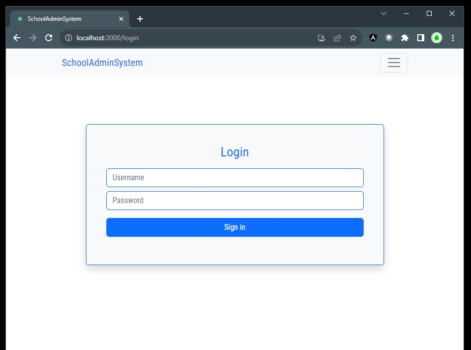
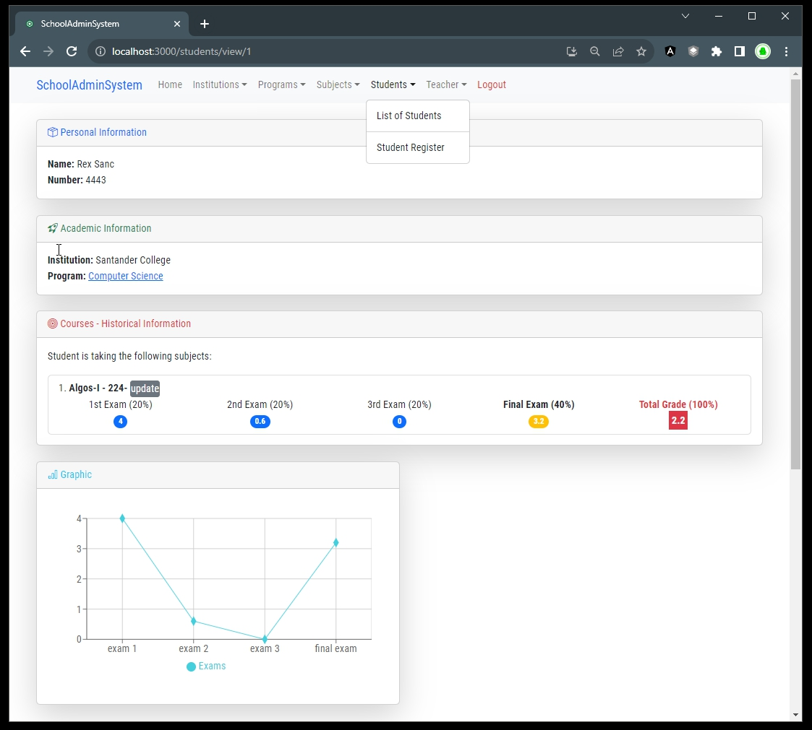
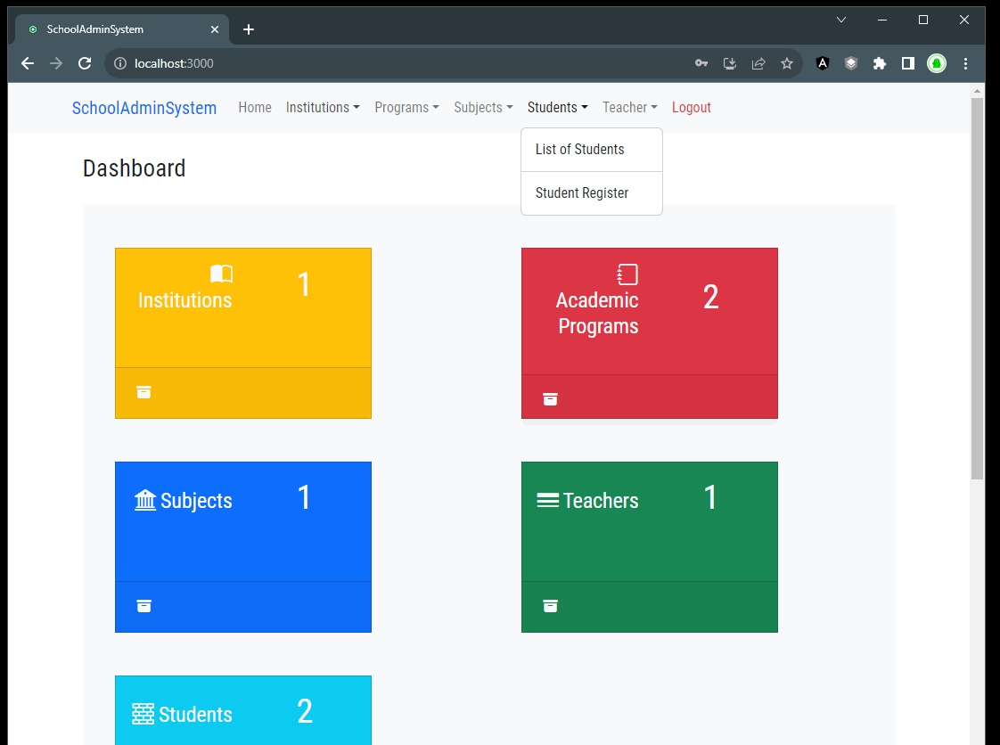
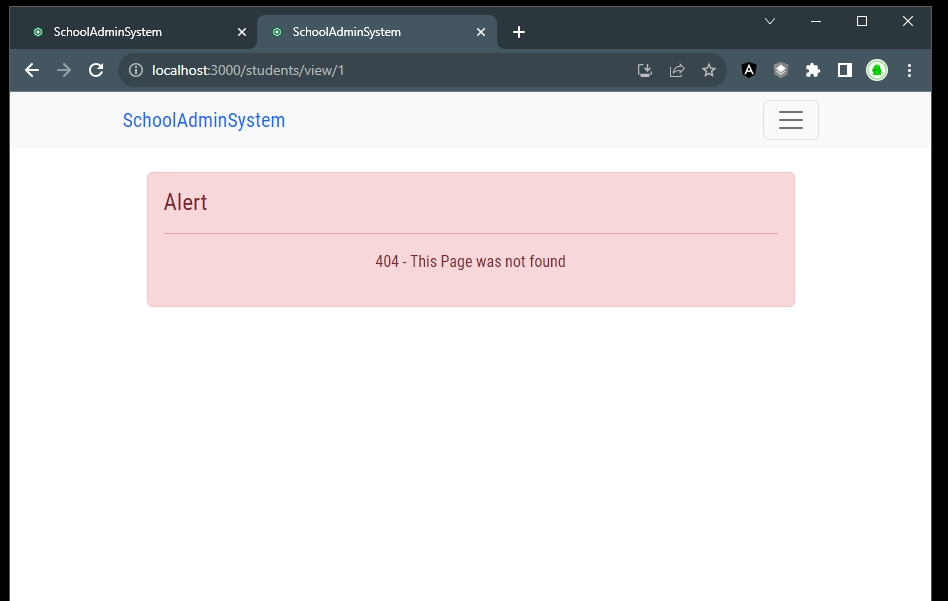
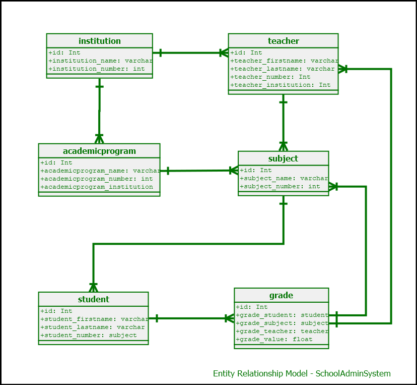

# Project Documentation


- Name: **SchoolSystemAdmin**
- Problem: solve the complexity of handling information about grades in schools in some regions where there is no access to software tools (specifically in Latin America).

- 
- 
- 
- 


## Distinctiveness and complexity

1. The design of the project considered a real-life scenario in a real context.
    - Many teachers in remote regions in South America do not have access to software tools that supports their work with students, meaning, many of them have to manually print excel sheets to record grades of the Students.
    - Even though there are many tech companies and the products are available, the economic support is reduced due to multiple reasons.
    - This software project is a potential solution to that problem.

2. The design starts with the potential entities involved and their hierarchy, such as Students, Teachers, Grades, a Subject, a Program, and an Institution, so an Entity–Relationship model diagram is included to record the relationship between them. 

    - 

3. From 2., the relations are:
    - Institution is the main entity and will contain multiple Programs. 
    - Each Program, will contain multiple Subjects.
    - Each Subject, will contain multiple Students.
    - Each Subject, will also contain a Teacher associated.
    - Each Student, will have a set of grades associated to the subject registered.
    - Each Grade, will contain information about 4 exams, 3 main exams and 1 final with a weight associated.
    - These models, should be able to be read, be modified, be deleted and be edited. 
    - Possibly some restrictions like, avoid deletion since is entity is being used, so consistency of information is maintained.

4. The architecture is intended for the backend to be completely separated from the frontend.

5. After creating the Data model, the technology used for this web app is listed below:
    - Frontend: `React.js` since managing the information could be complex using vanilla javascript. The model in react is function, using React Hooks.
    - Some additional packages were installed in node.js in order to setup the react.js environment.
    - Css Framework: `bootstrap 5`, increase the usability with a modern interface.
    - `jwt` tokens. 
    - Backend: `Django` web framework.
    - Backend: `Django Rest Framework` (DRF) since is written in python and leverage the knowledge already acquired.

6. The complexity is justified, additionally by:
    - Creating the endpoints necessary in the API, with all the methods required to update, cerate, delete and view
    - Creating the necessary components to render, so the user can interact with the application.
    - The design of the data model that includes 6 django models that depends from each other in a hierarchy structure.
    - The front end, will handle specific behavior based on the page and the event caused (load, click on a button, change in a components).
    - Each event, has an interaction with the backend, and used POST to create, PUT to modify and GET to bring data.
    - Some unique data-structures and nested json fields were created in order to reduce the number of calls to the api to the minimum possible. 
    - The application in general is mobile-responsive, usable from mobile devices.

- The database used in this case, is primarly SQL-based.
- Compatible with MySQL, MariaDB and SQLite databases, since data is structured.


## Folders and Folders description

- The project contains 2 main folders: `backend`, and `frontend` explained as follows

### Frontend folder

- Folder `schoolnotesfront/`
    - Folder `src/`
        - Folder ` components/` this folder contains the main components of the application.
            - File `Home.js` contains the screen that is showed after login in.
            - File `Login.js` contains the component top login into the application.
            - File `Logout.js` contains the component top logout application.
            - File `NavigationHome.js` contains the Navigation bar.
            - File `Dashboard1.jsx` contains the components of the dashboard
            - File `Footer1.jsx` contains the Footer component.
            - File `Notfound.jsx` contains the NotFound component to render each time a resource is trying to be accessed.
            - File `DeleteValidationModal.jsx`
            - File `ToastNotification.jsx`
            - Folder `institution/` contains components specifically for the institution.
                - File `InstitutionDeleteModal.jsx` Modal Component to confirm deletion of an Institution
                - File `InstitutionEditModal.jsx` Modal Component to handle Editing an Institution.
                - File `InstitutionList.jsx` React Component to handle the display of list of institutions.
                - File `InstitutionNewModal.jsx` Modal Component to handles creation of a new Institution.
                - File `InstitutionViewModal.js` Modal Component to handle view of an institution.
            - Folder `misc/` contains the component with the text for the Footer Component.
                - File `GeneralMisc.js` Component that returns the text that goes into the Footer.
            - Folder `program/` contains subcomponents to render info related to the Program.
                - File `ProgramList.jsx` React component to handle the list of Programs.
                - File `ProgramNewModal.jsx` Modal Component to handle the creation of a new Program.
                - File `ProgramProfile.jsx` Modal Component to handle the Program profile, includes links to subjects assigned to the actual program.
                - File `ProgramViewModal.js` Modal Component to handle the preview of the Program.
            - Folder `student/` contains components specifically for the institution view.
                - File `StudentProfile.jsx` handles the Student profile component.
                - File `StudentList.jsx` React component to handle the list of institutions.
                - File `StudentViewModal.jsx` handles the View information of a student.
                - File `StudentEditModal.jsx` Modal Component to Edit the Student information.
                - File `StudentGraph.jsx` is a Component that handles the Graph of the grades for students.
                - File `StudentNewModal.jsx` handles the Creation of a Student.
                - File `StudentRegister.jsx` handles the Registration of a student into a subject.
                - File `StudentGradesModal2.jsx` is a component to modify the grades of the student.
                - File `gradesOptions.json` contains the list of possible available values to be selected for grading a student.
            - Folder `subject/` contains components specifically for the Subject.
                - File `SubjectList.jsx` contains the logic and components to handle the List of subjects
                - File `SubjectViewModal.jsx` contains the modal component to view and handle the preview of a subject.
                - File `SubjectEditModal.jsx` contains the modal for editing a Subject.
                - File `RegisterStudentInSubjectModal.jsx` contains the component that allows a student to register for a Subject
                - File `SubjectNewModal.jsx` is the component to create a new Subject.
                - File `SubjectProfile.jsx` is the component to display the Subject Profile. 
            - Folder `teacher/` contains components specifically for the institution view.
                - File `TeacherList.jsx` contains the Component to handle the list of Teachers.
                - File `TeacherNewModal.jsx` contains the Modal Component to handle the creation of a Teacher.
                - File `TeacherViewModal.js` contains the Modal Component to handle the preview of a Teacher.
        - Folder ` context/` contains the context for the use of the useContext hook
            - File `LoginContext.js` Contains the context for some states in the application
        - Folder ` helpers/` contains functions used across components to make PUT, POST, GET requests to the aPI
            - File `GetData1.js` Function that assist multiple components to call the API using the GET http method
            - File `PostData1.js` Function that assist multiple components to call the API using the POST http method
            - File `PutData1.j` Function that assist multiple components to call the API using the PUT http method
        - Folder ` interceptors/` contains the axios interceptor, sends the token each time a request is made.
            - File `axios.js` contains a function that sends the token each time a request is made and each time axios is used.
        - File `App.js` is the main component of the application
    - Folder `public/` 
        - `index.html` main root folder to include the main component called "App"
    - File `package.json`, automatically created by node.js to record packages required by the project
    - File `package-lock.json`, automatically created by node.js

### Backend folder

- Folder `schoolapp/`
    - Folder `serializersall`
        - File `AcademicProgramSerializer.py` Contains the class for the serialization of the AcademicProgram View. 
        - File `GradeSerializer.py` Contains the class for the serialization of the Grade View and its related calls.
        - File `InstitutionSerializer.py` Contains the class for the serialization of the Institution View. 
        - File `SubjectSerializer.py` Contains the class for the serialization of the Subject View. 
        - File `TeacherSerializer.py` Contains the class for the serialization of the Teacher View. 
    - Folder `viewsall`
        - File `AcademicProgram_view.py` Contains the class of the Academic Program View called in the urls.py file.
        - File `Dashboard_view.py` Contains the classes of the Dashboard View called in the urls.py file.
        - File `Grade_view.py` Contains the classes of the Dashboard View called in the urls.py file.
        - File `Institution_view.py`
        - File `Subject_view.py`
        - File `Teacher_view.py`
    - File `views.py` contains all the views for the Students
    - File `urls.py` handles 
    - File `serializers.py` handles 
    - File `models.py` handles 
    - File `apps.py` handles 
- Folder `schoolsystem/` regular django folder automatically created by the folder that contains the main config of the project


---

## API Documentation

- Available endpoints and their respective HTTP methods for the API overview, as follows:


### Home

- **Endpoint:** `home/`
- **Method:** GET
- **Description:** This endpoint handles the login and password information.

- **Endpoint:** `home/`
- **Method:** POST
- **Description:** This endpoint handles the login and password information at the login time.

### Logout

- **Endpoint:** `logout/`
- **Method:** POST
- **Description:** This endpoint handles user logout.

### Institution

- **Endpoint:** `institution/`
- **Method:** GET
- **Description:** This endpoint retrieves information about all institutions.

- **Endpoint:** `institution/<integer>`
- **Method:** GET
- **Description:** This endpoint retrieves information about a specific institution identified by an id.

### Academic Program

- **Endpoint:** `academicprogram/`
- **Method:** GET
- **Description:** This endpoint retrieves information about all academic programs.

### Subject

- **Endpoint:** `subject/`
- **Method:** GET
- **Description:** This endpoint retrieves information about all subjects.

### Program Profile

- **Endpoint:** `programprofile/`
- **Method:** GET
- **Description:** This endpoint provides program profile information.

### Student

- **Endpoint:** `student/`
- **Method:** GET
- **Description:** This endpoint retrieves information about all students.

- **Endpoint:** `studentupdate/`
- **Method:** POST
- **Description:** This endpoint updates student information.

- **Endpoint:** `studentprofile/`
- **Method:** GET
- **Description:** This endpoint provides student specific information, including institution, academic program, subjects (including name, and number), and grades.
    - 
    ```json
        [
            {
                "id": 1,
                "student_firstname": "Rex",
                "student_lastname": "Sanc",
                "student_number": 4443,
                "student_institution": 1,
                "student_academicprogram": 2,
                "student_subjects": [
                    {
                        "id": 1,
                        "subject_name": "Algos-I",
                        "subject_number": 224,
                        "subject_grades": [
                            {
                                "id": 1,
                                "grade_e1": 4.0,
                                "grade_e2": 0.6,
                                "grade_e3": 0.0,
                                "grade_ef": 3.2
                            }
                        ]
                    }
                ]
            }
        ]
    ```

### Teacher

- **Endpoint:** `teacher/`
- **Method:** GET
- **Description:** This endpoint retrieves information about teachers.

### Student by Subject

- **Endpoint:** `studentbysubject/`
- **Method:** GET
- **Description:** This endpoint retrieves students based on subjects.

- **Endpoint:** `studentbysubject/`
- **Method:** GET
- **Description:** This endpoint provides additional information about students based on subjects.
    -
    ```json
        [
            {
                "subject_id": 1,
                "subject_name": "Algos-I",
                "students": [
                    {
                        "id": 1,
                        "student_firstname": "Rex",
                        "student_lastname": "Sanc",
                        "student_number": 4443,
                        "student_institution": 1,
                        "student_academicprogram": 2,
                        "student_subject": [
                            1
                        ]
                    }
                ]
            }
        ]
    ```

### Student by Program

- **Endpoint:** `studentbyprogram/`
- **Method:** GET
- **Description:** This endpoint retrieves students based on academic programs.
    - 
    ```json
        [
            {
                "id": 1,
                "student_firstname": "Rex",
                "student_lastname": "Sanc",
                "student_number": 4443,
                "student_institution": 1,
                "student_academicprogram": 2,
                "student_subject": [
                    1
                ]
            }
        ]
    ```

### Grade

- **Endpoint:** `grade/<integer>`
- **Method:** GET
- **Description:** This endpoint retrieves grade information for a specific id.

### Dashboard

- **Endpoint:** `dashboard/`
- **Method:** GET
- **Description:** This endpoint provides summary of the total number of entities.


## Annotations and Resources

- `npm init creact-app schoolnotesfront` or `npx create-react-app my-app`
- npm start
- npm run build (Bundles the app into static files for production.)
- npm test (Starts the test runner)
- npm run eject
- `cd schoolnotesfront` and `npm start`
- npm i react-bootstrap bootstrap
- react-bootstrap documentation at [https://react-bootstrap.netlify.app/docs/getting-started/introduction/](https://react-bootstrap.netlify.app/docs/getting-started/introduction/)
- `import 'bootstrap/dist/css/bootstrap.min.css';` is mandatory on `App.js` or `index.js`
- Material Icons (in `index.js`):
    - `<a href="#" class="view" title="View" data-toggle="tooltip"><i class="material-icons">&#xE417;</i></a>`
    - `<link rel="stylesheet" href="https://fonts.googleapis.com/icon?family=Material+Icons">`
    - Material Icons codes [https://codepen.io/btn-ninja/pen/YrXmax](https://codepen.io/btn-ninja/pen/YrXmax)
    - Fetch in reactjs (good material) [https://medium.com/nerd-for-tech/fetch-api-async-await-in-a-few-bites-6b4f19f7db9e](https://medium.com/nerd-for-tech/fetch-api-async-await-in-a-few-bites-6b4f19f7db9e)
    - good info: [https://blog.logrocket.com/modern-api-data-fetching-methods-react/](https://blog.logrocket.com/modern-api-data-fetching-methods-react/)
    - good info: [https://dmitripavlutin.com/javascript-fetch-async-await/](https://dmitripavlutin.com/javascript-fetch-async-await/)
    - to checkl: [https://codesandbox.io/s/agitated-haze-j9yc3?file=/src/App.js](https://codesandbox.io/s/agitated-haze-j9yc3?file=/src/App.js)
    - Nice react fetch example: [https://github.com/devopsdeveloper1107/React-Practical-2/blob/master/src/Components/Adduser.js](https://github.com/devopsdeveloper1107/React-Practical-2/blob/master/src/Components/Adduser.js)
- To run migrations after a big modification:
    - `rm -rf migrations/`
    - `rm -rf db.sqlite3`
    - `python manage.py makemigrations schoolapp`
    - `python manage.py migrate`
- include a file in a folder:
    - `from application.app.folder.file import func_name`
    - source: [https://stackoverflow.com/questions/4383571/importing-files-from-different-folder](https://stackoverflow.com/questions/4383571/importing-files-from-different-folder)
- Delete confirmation [https://codemoto.io/coding/react/react-delete-confirmation-modal](https://codemoto.io/coding/react/react-delete-confirmation-modal)
- React toastify [https://www.npmjs.com/package/react-toastify](https://www.npmjs.com/package/react-toastify)
- React Delete fetch [https://jasonwatmore.com/post/2020/11/11/react-fetch-http-delete-request-examples](https://jasonwatmore.com/post/2020/11/11/react-fetch-http-delete-request-examples)
- cors solution in node (using express): [https://stackoverflow.com/questions/57009371/access-to-xmlhttprequest-at-from-origin-localhost3000-has-been-blocked](https://stackoverflow.com/questions/57009371/access-to-xmlhttprequest-at-from-origin-localhost3000-has-been-blocked)
- Icons [https://www.toptal.com/designers/htmlarrows/symbols/](https://www.toptal.com/designers/htmlarrows/symbols/)
- nvm (Node Version Manager)
    - Downloaded nvm from [https://github.com/coreybutler/nvm-windows#readme]


